# Adobe Repacker and Installer Script - RIBS for Macintosh (for CS3 - CC 2017 (RIBS-based ones))
A .sh script that compresses unpacked Adobe RIBS assets and installs them.
- ~~NOTE: Script will be uploaded after sometime.~~
  - With my recent researches, it will now possible to install repacked assets. I will write a script in a near future. More information on https://github.com/eflanili7881/AdobeRepackerAndInstallerScript/blob/RIBS-mac-patchedbins/README.md

# CAUTION!
Please, don't use this script for piracy things. I wrote this script for who wants to store RIBS-based Adobe application installers with unpacked assets for various reasons. My reason was maximize deduplication ratings on my Windows Server Storage Spaces storage to store more programs, especially Adobe programs that has macOS and Windows versions. Because slightest compression and boom, dedup savings are almost gone. That's why I wrote this script. I will improve this script day by day.

## Credits
- Mentioned on https://github.com/eflanili7881/AdobeRepackerAndInstallerScript/blob/main/README.md#credits

## What does this script do?
This script compresses all unpacked assets that present on "payloads" and "packages" folder to temporary directory set by script, copies RIBS installer engine from installation media with unpacked assets excluded via excludepackages.txt and excludepayloads.txt that's generated via script and invokes Install.app on temporary directory set by script to install repacked product.

- ~~I think this approach only valid for CS5 and CS5.5 if I not able to patch AdobePIM.dylib.~~
  - ~~But **maybe** I can write small installer that puts necassary files into necassary locations for CS6 - CC 2015 with **no install** support provided by Adobe's self installer.~~
  - ~~Because Macintosh versions of RIBS installers have MUCH MORE clean file structure compared to Windows.~~
  - With my recent researches, it will now possible to install repacked assets for CS6 to CC 2015 (probably, every RIBS-based Adobe applications). More information on https://github.com/eflanili7881/AdobeRepackerAndInstallerScript/blob/RIBS-mac-patchedbins/README.md

## Limitations
- ~~If I correctly know, macOS doesn't have patched AdobePIM.dylib for installing custom assets for Adobe CS6 - CC 2015~~
  - ~~I tried to patch engine like in Windows, but it's almost impossible, but it isn't impossible, it takes too much time as they're almost no comments to parse packages.~~
  - With my recent researches, it will now possible to install repacked assets. More information on https://github.com/eflanili7881/AdobeRepackerAndInstallerScript/blob/RIBS-mac-patchedbins/README.md
  - But like in Windows, Adobe CS5.5 and below doesn't have signature verification for *.pima (actually, they're just .dmg files with .pima extension) and *.dmg archives.
- ~~CS3 and probably CS4 can't be installed from APFS volume, but CS3 and probably CS4 apps can be installed to APFS volume.~~
  - ~~If you try install CS3 and probably CS4 app from APFS volume, installer will throw white empty window titled as "Installer Alert". You can't continue installation from now on.~~
 
    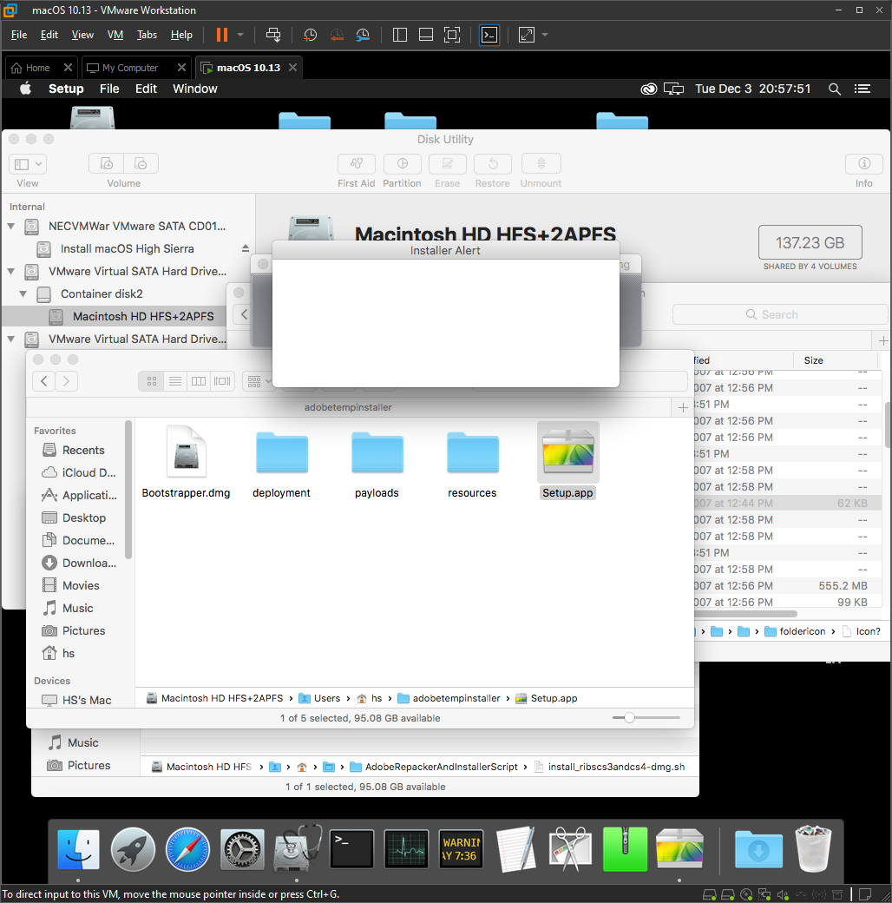

    - ~~To resolve this, go to (homeDirectoryOfYourAccount)/adobetempinstaller and copy all contents to a USB, disk image or physical disk partition that's formatted as HFS+. Script can be updated to make a disk image formatted as HFS+.~~
  - With v0.4.0, you can specify another location for temporary installer on CS3 and CS4.

## Special note
- With Adobe CC 2013 (7.x.x.x), *.dmg format with *.pima extension in packages folder and *.dmg format in payloads folder changed to *.zip format (On *payloads* folder, extension is changed to *.zip, but in *packages* folder, extension is still *.pima).
  - DMG-based installers uses:
    - APM (Apple partition map) partition map
    - single partition
    - HFS+ format
    - UDIF read-only compressed (zlib) disk images.
  
    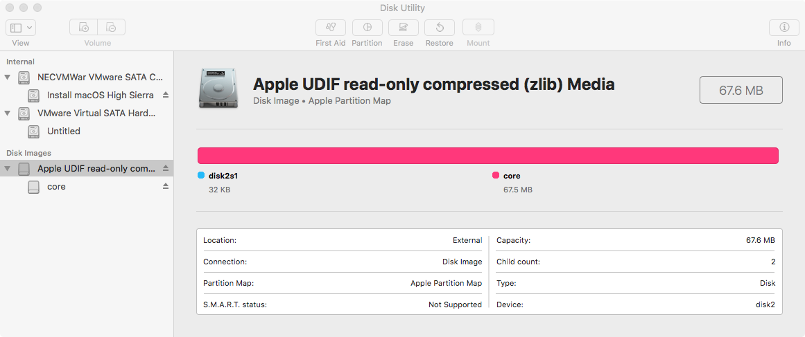

    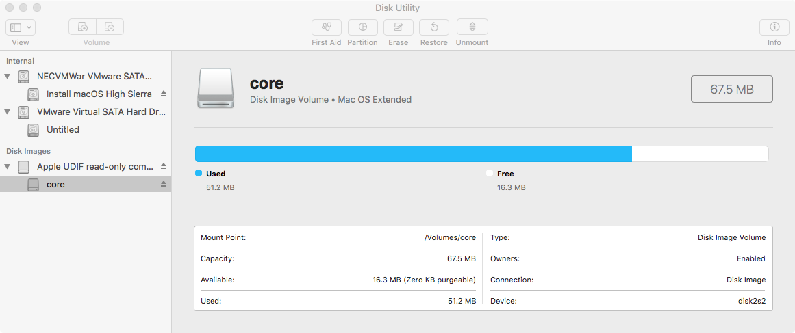
  - On packages folder, partition labels will be equal to package folder name (i.e. DECore uses DECore).
    - To clear confusion, \packages\core\PDApp.pima uses **core** partition label.

    
  - On payloads folder, partition labels will be some random? generated 16 character label.

    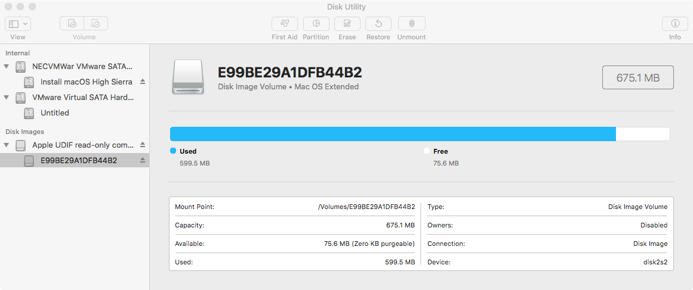
    - But partition labels and sizes can be what you want as I tested DECore.pima and AdobePremierePro6.0AllTrial.dmg for the unpack test.

      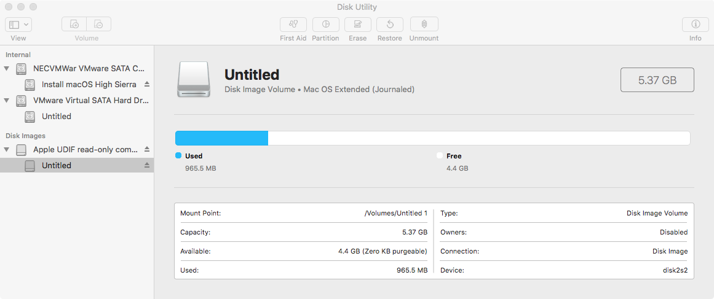

## Known bugs
- Not critical and it's only cosmetic, but some folders icon may not correctly installed.
  - You can fix icons via Finder.
    - Remove hidden Icon? from installed application folder.
   
      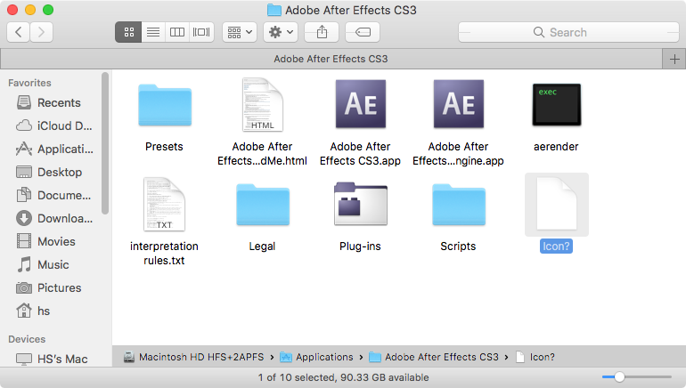

      - You can reveal hidden files via **command-shift-period** shortcut.
    - Open random image with Preview app or other folder properties with has icon.
      - From Preview app
        - Open random image file.

          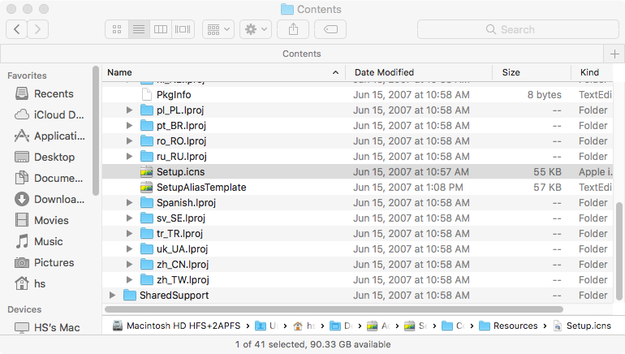
   
          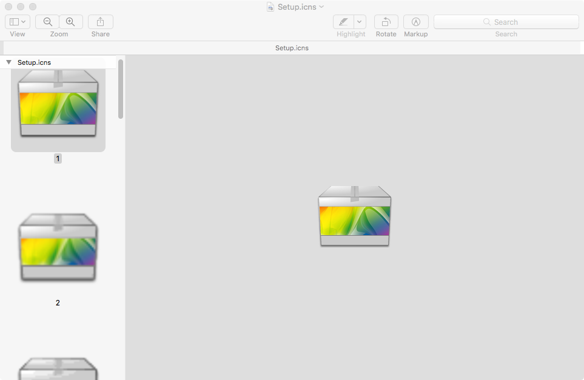

        - Press **command-a** to select first icon and **command-c** to copy it.
      - From folder with random icon
        - Open folder properties that has icon.
        - Select icon that's left side on folder name.
       
          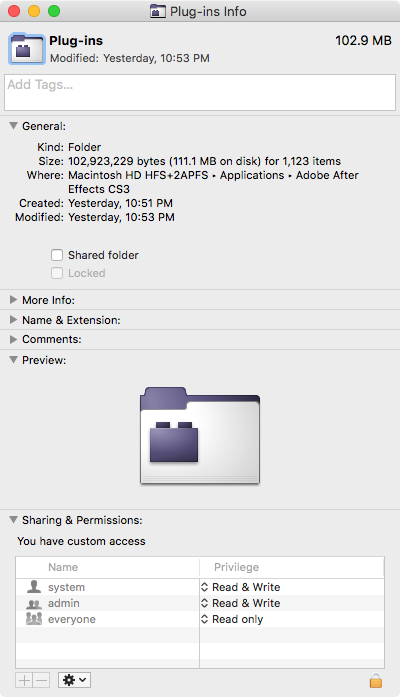

        - Press **command-c** to copy it.
    - Open folder properties of folder that you want to change it's icon.
    - Click folder icon that's left side on folder name.
   
      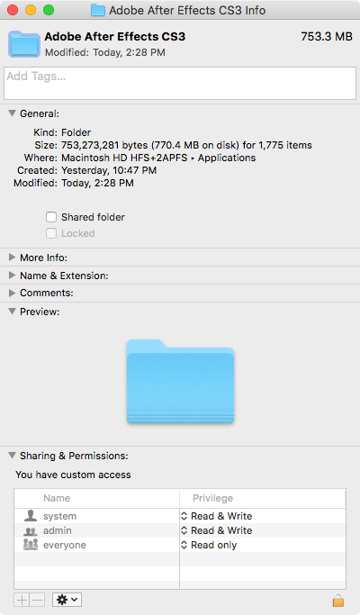

    - Press **command-v** to update folder icon.
   
      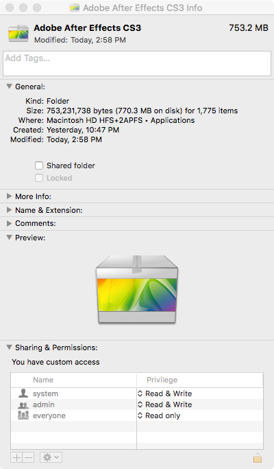

    - Remove hidden **Icon?** from installed application folder.
   
      
      
      - Finder cannot replace hidden files.
    - For CS5 and above
      - Open appropriate Install.db from unpacked software location with DB Browser for SQLite and go to table InstallFolderIcon.
 
        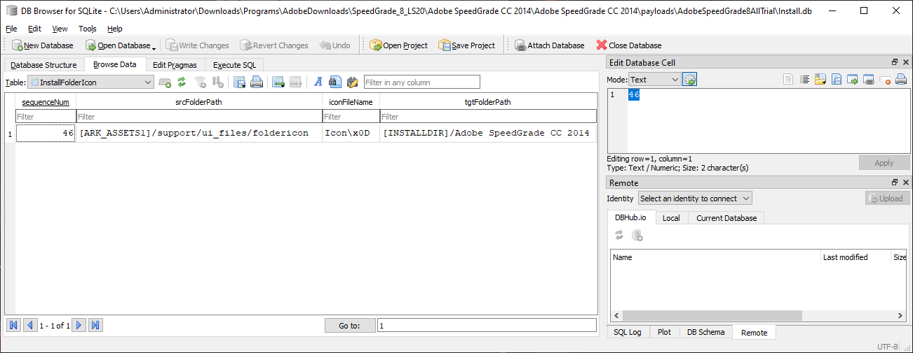

        - You can see icons that's gonna be installed.
    - For CS3 and CS4
      - Open appropriate Instructions.js from unpacked software location with any text editor and search **Icon\x0D**.
     
        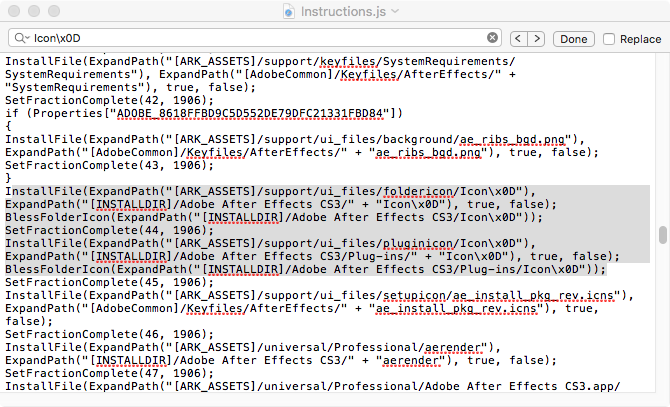

    - From unpacked software location, select **Icon?** from appropriate location and press **command-c** to copy it.
    - Go to appropriate folder and press **command-v** to paste it.
    - You'll see that folder icon is updated as it should be.

      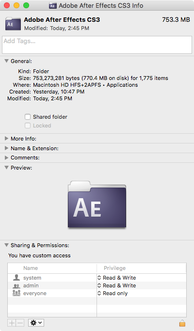
