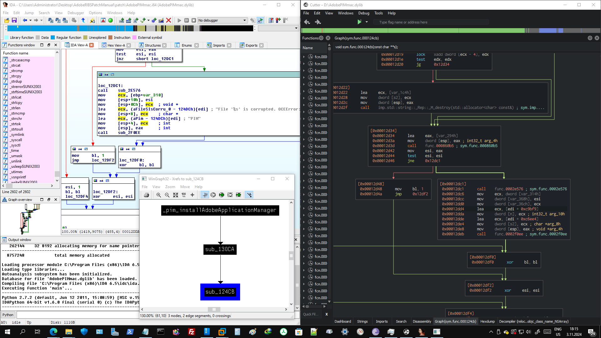
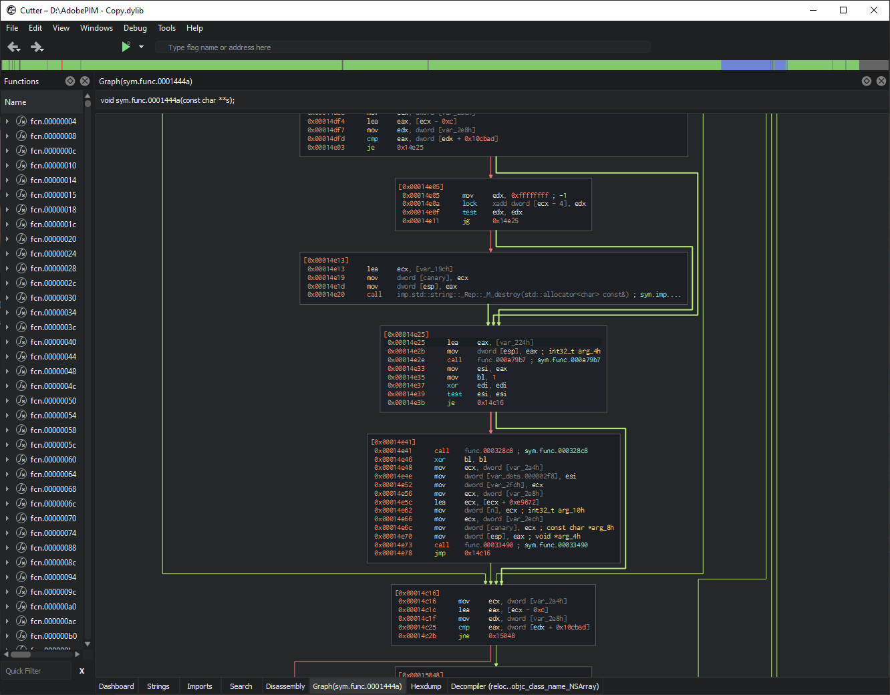
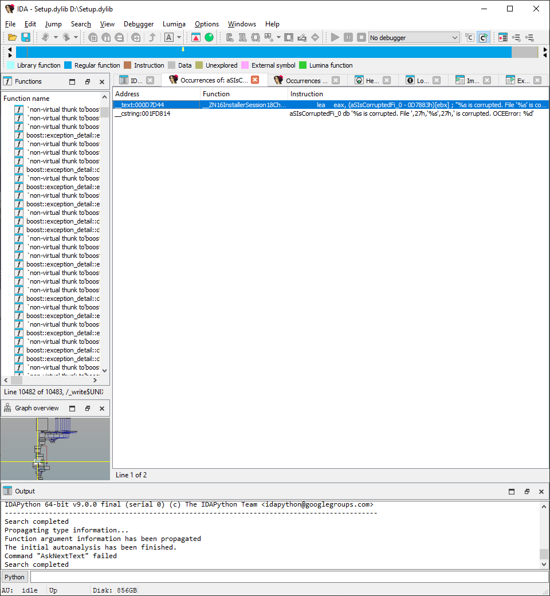
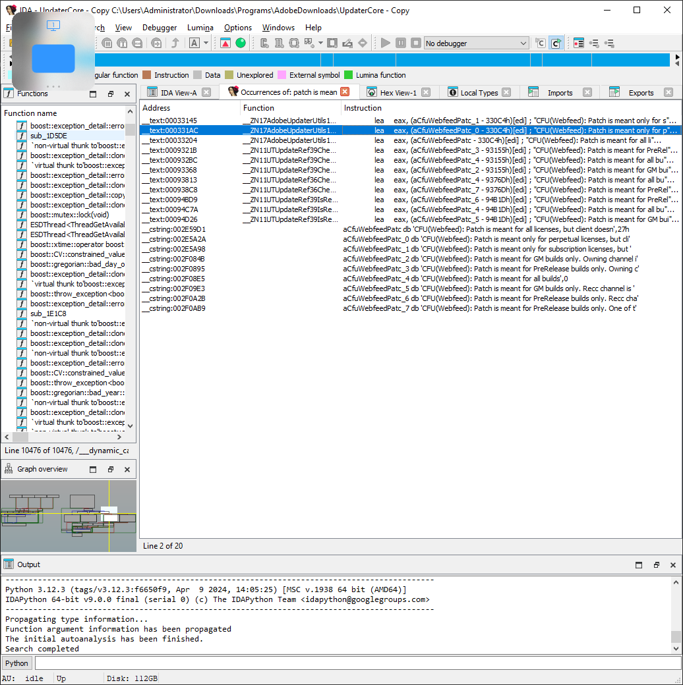

# Adobe Repacker and Installer Script - Patched Binaries for ZIP and DMG-based RIBS Installers for macOS (for CS6 - CC 2015)
A repo that contains patched binaries for installing unpacked Adobe RIBS assets.

# CAUTION!
Please, don't use this branch's content for piracy things. I put this patched binaries for who wants to install their unpacked RIBS-based Adobe application installers for various reasons. My reason was maximize deduplication ratings on my Windows Server Storage Spaces storage to store more programs.

# CAUTION!
Please, don't use this branch's content for piracy things. I put this patched binaries for who wants to install their unpacked RIBS-based Adobe application installers for various reasons. My reason was maximize deduplication ratings on my Windows Server Storage Spaces storage to store more programs.

# CAUTION!
Please, don't use this branch's content for piracy things. I put this patched binaries for who wants to install their unpacked RIBS-based Adobe application installers for various reasons. My reason was maximize deduplication ratings on my Windows Server Storage Spaces storage to store more programs.

## Why I repeated above thing 3 times?
Because I'm afraid that Adobe can copy-strike me like on archive.org. I put these instructions for **LEGITIMATE** users.

## Credits
- [Me](https://github.com/eflanili7881) for writing script.
- [Rizin](https://rizin.re) for [Cutter](https://cutter.re) reverse engineering program.
- [Hex-Rays](https://hex-rays.com/) for [IDA Pro 6.5](https://hex-rays.com/ida-pro) reverse engineering program.
- PainteR for patched binaries for Windows to understand verification mechanism on macOS binaries.
- Adobe Systems Incorporated for providing original binaries.

## What's this repo contains?
This repo contains patched binaries for installing unpacked Adobe RIBS applications.

## Special note
- When I examined AdobePIM.dylib version 8.0.0.72 (got it from Adobe Premiere Pro CC 2014's Install.app file) on IDA Pro 6.5, it revealed more clues:

  
  
  - When I looked script invoke path from IDA Pro 6.5, it follows this path (on AdobePIM.dylib version 8.0.0.72):
    - _pim_installAdobeApplication
    - sub_130CA (on IDA Pro 6.5)
    - sub_124CB (on IDA Pro 6.5)
      - On sub_124CB, magic happens on 0x12D46; rerouting **jne 0x12DC1** to **jne 0x12D48** (on Cutter by Rizin) bypasses verification on ZIP-based *.pima archives.
- When I looked script invoke path from IDA Pro 9.0, it follows this path (on AdobePIM.dylib version 6.0.335.0):

  
  
    - _pim_installPackage
    - sub_161FE
    - sub_8D28
      - On sub_8D28, magic happens on 0x956D; changing **mov [esp], eax** (on IDA Pro) to **jne 0x95D8** (on Cutter by Rizin) bypasses verification on DMG-based *.pima archives.
  - To patch dylibs:
    - Download Cutter from https://cutter.re or https://github.com/rizinorg/cutter/releases and IDA Pro 6.5 or newer on https://hex-rays.com/ida-pro
    - Install Cutter and IDA Pro 6.5 or newer.
    # - On AdobePIM.dylib (version 6.0.335.0)
      - You need to use this version for DMG-based installers (CS6 (6.x.x.x) and below) as CC 2013 (7.x.x.x) and above will use ZIP-based installers.
        - Open AdobePIM.dylib on IDA Pro and open it with Mach-O decompiler.
        - On IDA Pro, search for string **corrupted**
        - Search results should be contain 4 __text and 3 __cstring addresses.

          
          
        - Click the result that's on __text:0x9597

          
          
        - 2 box before connected on box that contains the result from previous step, look for string that before on **; try {**.

          
          
        - Now you got the necessary address (in case, it's 0x956D) for changing **mov [esp], eax** (on IDA Pro) to **jne 0x95D8**.
        - Open AdobePIM.dylib on Cutter with experimental (aaaa) mode and in write mode (-w).
        - Jump to address 0x956D on Cutter.

          
          
        - Change **mov dword [esp], eax** to **jne 0x95D8** with disabling *Fill all remaining bytes with NOP opcodes*.
        - Changing will invalidate function on address 0x9576 but it's not going to be a problem.
        - When you reload the file on Cutter, graph will turn into this:

          
          
        - As you can see, the box that contains error condition for signature verification failure is not visible anymore.
    # - On AdobePIM.dylib (version 8.0.0.72):
      - You need to use this version for ZIP-based installers (CC 2013 (7.x.x.x) and above) as CS6 (6.x.x.x) and below will use DMG-based installers.
        - Open AdobePIM.dylib on IDA Pro and open it with Mach-O decompiler.
        - On IDA Pro, search for string **aSignaturePimaC**.
        - 3 box later connected on box that contains aSignaturePimaC (in case, sub_12D34 on version 8.0.0.73), look for value **jnz short loc_12DC1** (on address 0x12D46).

          
          
        - Now, you got the necessary address for changing 0x12DC1 to 0x12D48.
        - Open AdobePIM.dylib on Cutter with experimental (aaaa) mode and in write mode (-w).
        - Jump to address 0x12D46 on Cutter.

          
          
        - Change 0x12DC1 to 0x12D48 with disabling *Fill all remaining bytes with NOP opcodes*.
        - When you reload the file on Cutter, graph will turn into this:
        
          
          
        - As you can see, the box that contains error condition for signature verification failure is not visible anymore.
    # - On AdobePIM.dylib (version 9.0.0.72)
      - You need to use this version for ZIP-based installers (CC 2013 (7.x.x.x) and above) as CS6 (6.x.x.x) and below will use DMG-based installers.
        - Open AdobePIM.dylib on IDA Pro and open it with Mach-O decompiler.
        - On IDA Pro, search for string **corrupted**.
        - Click the result on **0x14e25**
 
          
          
        - Find the start of the function that contains the result came from the previous step (in case, it's **0x14e25**).
 
          
          
        - Now, you got the necessary address for changing **lea eax, [ebp - 0x220]** to **jne 0x14889**.
        - Open AdobePIM.dylib on Cutter with experimental (aaaa) mode and in write mode (-w).
        - Jump to address 0x14E25 on Cutter.
 
          
          
        - Change **lea eax, [ebp - 0x220]** to **jne 0x14889** with disabling *Fill all remaining bytes with NOP opcodes*.
        - When you reload the file on Cutter, graph will turn into this:
       
          
          
        - As you can see, the box that contains error condition for signature verification failure is not visible anymore.
    # - On Setup.dylib (version 6.0.98.0)
      - You need to use this version for DMG-based installers (CS6 (6.x.x.x) and below) as CC 2013 (7.x.x.x) and above will use ZIP-based installers.
        - Open Setup.dylib on IDA Pro and open it with Mach-O decompiler.
        - On IDA Pro, search for string **aSIsCorruptedFi_0**.
        - It should contain 1 __text and 1 __cstring results.

          
          
        - 1 box before connected on box that contains the result from previous step, look for string that before on **; try {**.
        - Now you got the necessary address (in case, it's 0xD7CB9) for changing **mov [esp], esi** (on IDA Pro) to **jne 0xD7DC4** (on Cutter by Rizin).

          
          
        - Open Setup.dylib on Cutter with experimental (aaaa) mode and in write mode (-w).
        - Jump to address 0xD7CB9 on Cutter.

          
          
        - Change **mov dword [esp], esi** to **jne 0xD7DC4** with disabling *Fill all remaining bytes with NOP opcodes*.
        - Changing will invalidate function on address 0xD7CD5 but it's not going to be a problem.
        - When you reload the file on Cutter, graph will turn into this:

          
          
        - As you can see, the box that contains error condition for signature verification failure is not visible anymore.
    # - On Setup.dylib (version 8.0.0.15)
      - You need to use this version for ZIP-based installers (CC 2013 (7.x.x.x) and above) as CS6 (6.x.x.x) and below will use DMG-based installers.
      - Also, this one is pretty hard because of absence of comments (they exist in __cstring section, but not exist in __text section). But if you understand the basics, you can perform this steps on other versions of Setup.dylib with proper hexadecimal addresses for specific versions.
        - Open Setup.dylib on IDA Pro and open it with Mach-O decompiler.
        - On IDA Pro, search for string **verifying**
        - Click the result on address 0xb7c23
       
          
 
        - Go to address 0xb801d
       
          

          - Setup.dylib binaries on macOS most probably have verification mechanism on function that contains result from previous step. On versions that doesn't contain strings, that's the location you should look.
            - On IDA Pro, here's the required visual location to call verification mechanism. On other versions, it's generally same.
              
              
           
            - Required location to go is last call function on the box that viewed from previous step (in case, it's 0xb742c).
        - On function 0xb742c, go to this visual location.
         
          
            
        - Locate the call function that has CryptoPP in it (in case, it's 0x1861d9)
 
          
 
          - Here's the visual location.
         
            
 
        - Locate the start address of function that contains function that has CryptoPP in it (in case, it's 0xb78f7).
       
          

        - You got the necessary location to change on Cutter from **mov [esp], ebx** to **jne 0xB7AAE**.
        - Open Setup.dylib on Cutter with experimental (aaaa) mode and in write mode (-w).
        - Jump to address 0xb78f7 on Cutter.
 
          

        - Change **mov [esp], ebx** to **jne 0xb7aae** with disabling *Fill all remaining bytes with NOP opcodes*.
        - Changing will invalidate function on address 0xb790e but it's not going to be a problem.
        - When you reload the file on Cutter, graph will turn into this:
       
          

        - As you can see, the box that contains error condition for signature verification failure is not visible anymore.
    # - On Setup.dylib (version 9.0.0.10 (from Adobe Application Manager 9.0.0.72, got from Adobe Premiere Pro CC 2015))
      - You need to use this version for ZIP-based installers (CC 2013 (7.x.x.x) and above) as CS6 (6.x.x.x) and below will use DMG-based installers.
      - Also, this one is pretty hard because of absence of comments (they exist in __cstring section, but not exist in __text section). But if you understand the basics, you can perform this steps on other versions of Setup.dylib with proper hexadecimal addresses for specific versions.
        - Open Setup.dylib on IDA Pro and open it with Mach-O decompiler.
        - On IDA Pro, search for string **verifying**
        - Click the result on address 0xACB51
 
          
          
        - Go to address 0xACE93.
 
          
          
          - Setup.dylib binaries on macOS most probably have verification mechanism on function that contains result from previous step. On versions that doesn't contain strings, that's the location you should look.
            - On IDA Pro, here's the required visual location to call verification mechanism. On other versions, it's generally same. 
   
              
              
            - Required location to go is last call function on the box that viewed from previous step (in case, it's 0xAC182).
        - On function 0xAC182, go to this visual location.
 
          
          
        - Locate the call function that has CryptoPP in it (in case, it's 0x201B26).
 
          
          
          - Here's the visual location:
 
            
            
        - Locate the start address of function that contains function that has CryptoPP in it (in case, it's 0xAC537).
 
          
          
        - You got the necessary location to change on Cutter from **mov [esp], ebx** to **jne 0xAC5F4**.
        - Open Setup.dylib on Cutter with experimental (aaaa) mode and in write mode (-w).
        - Jump to address 0xAC537 on Cutter.
 
          
          
        - Change **mov [esp], ebx** to **jne 0xAC5F4** with disabling *Fill all remaining bytes with NOP opcodes*.
        - Changing will invalidate function on address 0xAC54D but it's not going to be a problem.
        - When you reload the file on Cutter, graph will turn into this:
 
          
          
        - As you can see, the box that contains error condition for signature verification failure is not visible anymore.
    # - On Setup.dylib (version 9.0.0.65 (from Adobe Application Manager 10.0.0.47, got from Adobe Premiere Elements 15 install media))
      - You need to use this version for ZIP-based installers (CC 2013 (7.x.x.x) and above) as CS6 (6.x.x.x) and below will use DMG-based installers.
        - Adobe Application Manager version 9.0.0.72 has Setup.dylib version 9.0.0.10 but required sections location was not mentioned in file.

          
          
        - But Adobe Application Manager version 10.0.0.47 has Setup.dylib version 9.0.0.65 and it mentions the required address to patch the file.

          
          
          - Open Setup.dylib on IDA Pro and open it with Mach-O decompiler.
          - On IDA Pro, search for string **corrupted**
          - Click on result that contains **aSIsCorruptedFi_0**.

            
            
          - Locate the largest function that's connected to box that contains result from previous step. It's usually spans some of it's content to box that contains result from previous step.
          - Locate the largest function's start address (On version 9.0.0.65, it's 0xBDAD6).

            
            
          - You got the necessary location to change on Cutter.
          - Open Setup.dylib on Cutter with experimental (aaaa) mode and in write mode (-w).
          - Jump to address 0xBDAD6 on Cutter.

            
            
          - Change **mov dword [esp], ebx** to **jne 0xBDC9E** with disabling *Fill all remaining bytes with NOP opcodes*.
          - Changing will invalidate function on address 0xBDAEC but it's not going to be a problem.
          - When you reload the file on Cutter, graph will turn into this:

            
            
          - As you can see, the box that contains error condition for signature verification failure is not visible anymore.
    # - On UpdaterCore.framework/Versions/A/UpdaterCore (version 9.0.0.30)
      - Open UpdaterCore.framework/Versions/A/UpdaterCore on IDA Pro and open it with Mach-O decompiler.
      - On IDA Pro, search for string **patch is mean**
      - Click on result that contains **Patch is meant only for (very first 2 results)**.
   
        

      - Locate the very first box thats connected to result from previous step.
   
        

      - Note the address of **call $+5**.
      - Now you got necessary address to change on Cutter.
      - Open UpdaterCore.framework/Versions/A/UpdaterCore on Cutter with experimental (aaaa) mode and in write mode (-w).
      - Jump to address 0x330ff on Cutter.
   
        

      - Change **call 0x33104** to **jmp 0x33275** with disabling *Fill all remaining bytes with NOP opcodes*.
      - When you reload the file on Cutter, graph will turn into this:

        

      - With this, you can install subscription updates on perpetually licensed apps or vice versa.
    # - On UpdaterCore.framework/Versions/A/UpdaterCore (version 8.0.0.14)
      - Open UpdaterCore.framework/Versions/A/UpdaterCore on IDA Pro and open it with Mach-O decompiler.
      - On IDA Pro, search for string **patch is mean**
      - Click on result that contains **Patch is meant only for (very first 3 results)**.
 
        

      - Locate the very first box thats connected to result from previous step.
 
        
        
      - Note the address of **call $+5**.
      - Now you got necessary address to change on Cutter.
      - Open UpdaterCore.framework/Versions/A/UpdaterCore on Cutter with experimental (aaaa) mode and in write mode (-w).
      - Jump to address 0x32c2c on Cutter.
 
        

      - Change **call 0x32c31** to **jmp 0x32cab** with disabling *Fill all remaining bytes with NOP opcodes*.
      - When you reload the file on Cutter, graph will turn into this:
 
        

      - With this, you can install subscription updates on perpetually licensed apps or vice versa.
    # - On UpdaterCore.framework/Versions/A/UpdaterCore (version 9.0.0.4)
      - Open UpdaterCore.framework/Versions/A/UpdaterCore on IDA Pro and open it with Mach-O decompiler.
      - On IDA Pro, search for string **patch is mean**
      - Click on result that contains **Patch is meant only for (very first 2 results)**.
   
        

      - Locate the very first box thats connected to result from previous step.

        

      - Note the address of **call $+5**.
      - Now you got necessary address to change on Cutter.
      - Open UpdaterCore.framework/Versions/A/UpdaterCore on Cutter with experimental (aaaa) mode and in write mode (-w).
      - Jump to address 0x330bf on Cutter.

        

      - Change **call 0x330c4** to **jmp 0x33235** with disabling *Fill all remaining bytes with NOP opcodes*.
      - When you reload the file on Cutter, graph will turn into this:
   
        

      - With this, you can install subscription updates on perpetually licensed apps or vice versa.
    # - On UpdaterCore.framework/Versions/A/UpdaterCore (version 6.0.0.67)
      - Open UpdaterCore.framework/Versions/A/UpdaterCore on IDA Pro and open it with Mach-O decompiler.
      - On IDA Pro, search for string **patch is mean**
      - Click on result that contains **Patch is meant only for (very first 3 results)**.

        

      - Locate the very first box thats connected to result from previous step.

        

      - Note the address of **call $+5**.
      - Now you got necessary address to change on Cutter.
      - Open UpdaterCore.framework/Versions/A/UpdaterCore on Cutter with experimental (aaaa) mode and in write mode (-w).
      - Jump to address 0x2acd5 on Cutter.

        

      - Change **call 0x2acda** to **jmp 0x2af13** with disabling *Fill all remaining bytes with NOP opcodes*.
      - When you reload the file on Cutter, graph will turn into this:

        

      - With this, you can install subscription updates on perpetually licensed apps or vice versa.
## How to build unpacked RIBS app installer?
- I assume you got:
  - RIBS-based installer for your Adobe application.
- Extract your desired app installer to a directory.
- On **packages** folder, extract every *.pima archive or disk images to same folder where original *.pima archive or disk image is located.
  - Structure should like this:
    - packages/UWA/UWA
      - If it's *.zip archive:
        - <contentsOfUWA.pimaArchive>
      - If it's *.dmg disk image:
        - <diskLabelOfUWA.pima>
          - <contentsOfUWA.pimaDiskImage>
    - packages/UWA/UWA.sig
    - packages/UWA/UWA.pimx
- Delete original *.pima archives or disk images after extraction is done.
- On **payloads** folder, extract every *.zip archive or *.dmg disk images to same folder where original *.zip archive is located.
  - Structure should like this:
    - payloads/AdobeSpeedGrade9AllTrial/AdobeSpeedGrade9AllTrial
      - If it's *.zip archive:
        - <contentsOfAdobeSpeedGrade9AllTrial.zipArchive>
      - If it's *.dmg disk image:
        - <diskLabelOfAdobeSpeedGrade9AllTrial.dmg>
          - <contentsOfAdobeSpeedGrade9AllTrial.dmgDiskImage>
    - payloads/AdobeSpeedGrade9AllTrial/AdobeSpeedGrade9AllTrial.sig
    - <otherFilesThatDoesn'tImportant>
- Make backup of your AdobePIM.dylib.
- Patch the AdobePIM.dylib.
- Move your original AdobePIM.dylib to AdobePIM_original.dylib.
- Make backup of your packages/DECore/DECore/DE6/Setup.dylib.
- Patch the packages/DECore/DECore/DE6/Setup.dylib.
- Move your original packages/DECore/DECore/DE6/Setup.dylib to packages/DECore/DECore/DE6/Setup_original.dylib.
- Make backup of your packages/UWA/UWA/UpdaterCore.framework/Versions/A/UpdaterCore.
- Patch the packages/UWA/UWA/UpdaterCore.framework/Versions/A/UpdaterCore.
- Move your original packages/UWA/UWA/UpdaterCore.framework/Versions/A/UpdaterCore to packages/UWA/UWA/UpdaterCore.framework/Versions/A/UpdaterCore_original.
- Copy your unpacked installer to your storage server and run deduplication right after unpacked installer is copied if you want.
