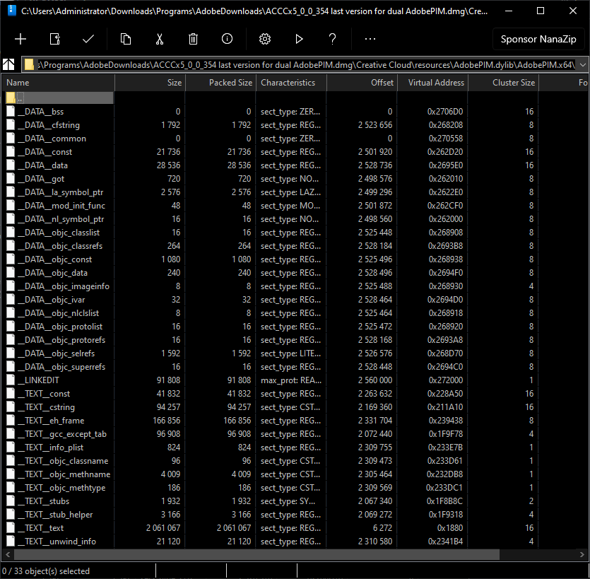

# Adobe Repacker and Installer Script - Patched Binaries for ZIP-based HyperDrive Installers for Macintosh (for CC 2015 - present)
A repo that contains patched binaries for installing unpacked Adobe Creative Cloud *.pima assets.

# CAUTION!
Please, don't use this branch's content for piracy things. I put this patched binaries for who wants to install their unpacked RIBS-based Adobe application installers for various reasons. My reason was maximize deduplication ratings on my Windows Server Storage Spaces storage to store more programs.

# CAUTION!
Please, don't use this branch's content for piracy things. I put this patched binaries for who wants to install their unpacked RIBS-based Adobe application installers for various reasons. My reason was maximize deduplication ratings on my Windows Server Storage Spaces storage to store more programs.

# CAUTION!
Please, don't use this branch's content for piracy things. I put this patched binaries for who wants to install their unpacked RIBS-based Adobe application installers for various reasons. My reason was maximize deduplication ratings on my Windows Server Storage Spaces storage to store more programs.

## Why I repeated above thing 3 times?
Because I'm afraid that Adobe can copy-strike me like on archive.org. I put these instructions for **LEGITIMATE** users.

## Credits
- [Me](https://github.com/eflanili7881) for writing script.
- [Rizin](https://rizin.re) for [Cutter](https://cutter.re) reverse engineering program .
- [Hex-Rays](https://hex-rays.com/) for [IDA Pro 6.5](https://hex-rays.com/ida-pro) reverse engineering program.
- PainteR for patching AdobePIM.dll (RIBS-based installers) for understanding verification algorithm on HyperDrive-based installers.
- Adobe Systems Incorporated for providing original binaries.

## What's this repo contains?
This repo contains patched binaries for installing unpacked Adobe Creative Cloud *.pima assets.

## Special note
- Normally, HyperDrive-based installers doesn't have any verification mechanism for "products" folder. But on "packages" folder, HyperDrive-based installers enforce signature to be valid.
  - If you try patch AdobePIM.dll with Set-up.exe version **x>=4.6.0.391**, it gives error 42 or 72.
 
    

    

    - When I try to launch installer via **\packages\ACC\Utils\Utils.pima\Creative Cloud Installer.app (copied it Creative Cloud's install root (version x>=4.6.0.391))**, error 72 appears.

      

      

      

      - Both errors suggests it's signature validation error.
    - Because version **x>=4.6.0.391**, it enforces Adobe account login and file signatures to be valid.

      

      - If you try to install Adobe Creative Cloud with Install.app version **x>=4.6.0.391** above errors will occur.
        - **/Install.app** and **/packages/ACCC/Utils/Utils.pima/Creative Cloud Installer.app**'s file sizes and hashes will be different for version **x>=4.6.0.391**.
  - But Install.app version **x<=4.5.0.331** doesn't enforces user to login with Adobe account and file signature to be valid. With this, you can patch AdobePIM.dylib and use Install.app version **x<=4.5.0.331**, you can install repacked *.pima archives with no issue.
 
    

    - **/Install.app** and **/packages/ACCC/Utils/Utils.pima/Creative Cloud Installer.app**'s file sizes and hashes will be same for version **x<=4.5.0.331**.
    - But if you try to install HyperDrive-based apps with patched AdobePIM.dylib and Install.app from **/packages/ACCC/HDCore/HDCore.pima/Install.app (x<=4.5.0.331)** or **/packages/ADC/HDBox/HDBox.pima/Install.app (x>=4.4.0.294)**, it gives error about installer file maybe damaged.
      - x<=4.3.0.256:
     
        

      - x>=4.4.0.294:

        

      - But if you install Creative Cloud first, reverting patch on AdobePIM.dylib that I'm gonna mention on "To patch dylib's" section or restoring original AdobePIM.dylib and then running Install.app from **\packages\ACCC\HDCore\HDCore.pima\Install.app (x<=4.3.0.256)** or **\packages\ADC\HDBox\HDBox.pima\Install.app (x>=4.4.0.294)** will work as HyperDrive installer will skip already installed Adobe Creative Cloud packages.
        - You must disconnect from internet if you:
          - Get "Update your browser" notification,
          - Don't want to use Adobe account.
          - Or want to prevent Adobe Creative Cloud to auto-update itself at least for installation process.
  - To patch dylibs:
    - Download Cutter from https://cutter.re or https://github.com/rizinorg/cutter/releases and IDA Pro 6.5 or newer on https://hex-rays.com/ida-pro
    - Install Cutter and IDA Pro 6.5 or newer.
    # - On AdobePIM.dylib (version 5.1.0.407)
      - Probably you can use this method for all versions.
        - I don't know much about dual architecture dylibs.
      - AdobePIM.dylib version x<=5.0.0.354 uses dual architecture design.
   
        
 
        
        - x86 section:
       
          

          
 
        - x64 section:
       
          

          

        - ARM builds of Creative Cloud also uses dual architecture design.
       
          
 
          
 
          - ARM64 section:
         
            

            
 
          - x64 section:
         
            
            
            

      - Version x>=5.1.0.407 uses only x64 architecture.
   
        

        

        - ARM builds of Creative Cloud also uses dual architecture design.
          - But x64 builds of Creative Cloud still uses only x64 architecture.
         
            

            

      - Because of that, currently only version x>=5.1.0.407 can be patched.
    - Open AdobePIM.dylib with IDA Pro 6.5 or newer with MachO compiler.
    - On IDA Pro, search for string **corrupt**.
    - Select **aFileSIsCorrupted_0** that's on bottom (In case, it's 0x13D0A7)
   
      

      
      
    - Locate the beginning of a function that contains result from previous step (in case, it's 0x13D073).
   
      

    - You've got necessary address to change on Cutter.
    - Open AdobePIM.dylib on Cutter with experimental (aaaa) mode and in write mode (-w).
    - Jump to address 0x13D073.
   
      

    - Change **lea rdi, [rbp+var_258]** to **jne 0x13c6ce** with disabling *Fill all remaining bytes with NOP opcodes*.
    - It will invalidate function on **0x13d079** but it's not going to be a problem.
    - When you reload file with same settings, graph will turn into this:
   
      

    - As you can see, the box that contains error condition for signature verification failure is not visible anymore.

## How to build unpacked HyperDrive app installer?
Currently script doesn't repack Creative Cloud packages on **packages** folder (*.pima archives). I will update script to repack these packages as well.
- Be sure to unpack archives/images on macOS if you don't want to deal with broken symbolic links.
- I assume you got:
  - **ACCCx4_5_0_331.dmg** (If you're gonna use Adobe Creative Cloud version **x>=4.6.0.384**),
  - **ACCCx5_3_1_470.dmg** (For installing HyperDrive-based applications with same **packages** structure from Creative Cloud installer if you're gonna use **x=>5.3.5.518 (or 5.3.5.499 if you're gonna use prerelease copy of first Creative Cloud version that supports ARM64 platform natively.)**),
  - **ACCCx(version_numer_you_want).dmg** (You can use only this version if you're gonna use Adobe Creative Cloud version **x<=4.5.0.331**),
  - **products** folder for your app.
  - and **resources/content/images/appIcon.png** for your product.
    - (Optional) and **resources/content/images/appIcon2x.png** for your product.
- Extract **ACCCx(version_numer_you_want).dmg** to a directory.
- Delete Install.app and replace Install.app from **ACCCx4_5_0_331.dmg**.
  - Or **ACCCx(version_numer_you_want).dmg** if you're gonna use Adobe Creative Cloud version **x<=4.5.0.331**.
- Then, rename Install.app to anything you want (i.e. Install_CC.app (for installing Adobe Creative Cloud)).
- On **packages** folder, extract every *.pima archive to same folder where original *.pima archive is located.
  - Structure should like this:
    - packages/ADC/HDBox/HDBox
      - <contentsOfHDBox.pimaArchive>
    - packages/ADC/HDBox/HDBox.sig
    - packages/ADC/HDBox/HDBox.pimx
- Delete original *.pima archives after extraction is done.
- Put **products** folder to where you **ACCCx(version_numer_you_want).dmg** is extracted.
- On **products** folder, extract every *.zip archive to same folder where original *.zip archive is located.
  - Structure should like this:
    - products/AUDT/AdobeAudition10All
      - <contentsOfAdobeAudition10All.zipArchive>
    - products/AUDT/application.json
- Delete original *.zip archives after extraction is done.
- Put **resources/content/images/appIcon.png** to where you **ACCCx(version_numer_you_want).dmg** is extracted.
  - (Optional) Put **resources/content/images/appIcon2x.png** to where you **ACCCx(version_numer_you_want).dmg** is extracted.
- Get Install.app from **ACCCx(version_numer_you_want).dmg/packages/ADC/HDBox/HDBox.pima/Install.app** and put Install.app to where you extracted **ACCCx(version_numer_you_want).dmg** if bundled version of Creative Cloud is **x<=5.3.1.470**.
  - Get Install.app from **ACCCx5_3_1_470.dmg/packages/ADC/HDBox/HDBox.pima/Install.app** and put Install.app to where you extracted **ACCCx5_3_1_470.dmg** if bundled version of Creative Cloud is **x=>5.3.5.518 (or 5.3.5.499 if you're gonna use prerelease copy of first Creative Cloud version that supports ARM64 platform natively.)**.
- Rename Install.app to anything you want (i.e. Install_HD.app (for installing Adobe HyperDrive-based applications)).
- Move your original AdobePIM.dylib to AdobePIM_original.dylib.
- Make backup of your AdobePIM.dylib.
- Patch the AdobePIM.dylib.
- Move your patched AdobePIM.dylib to AdobePIM_patched.dylib.
- Copy your unpacked installer to your storage server and run deduplication right after unpacked installer is copied if you want.
