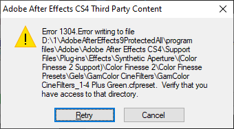
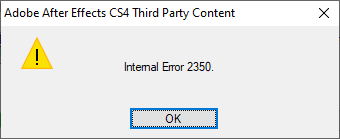
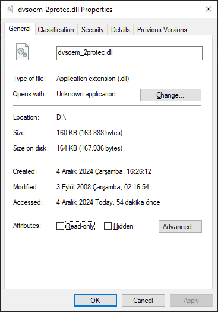
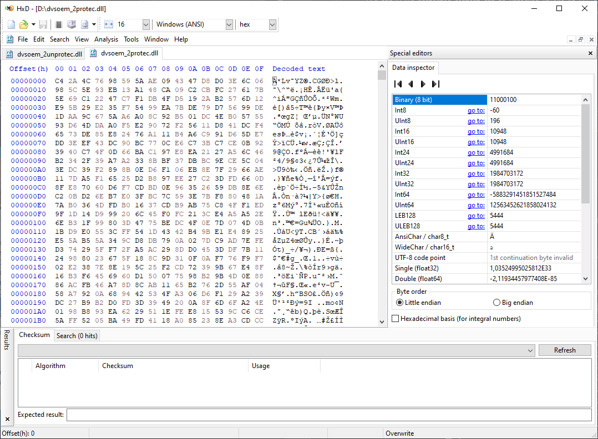
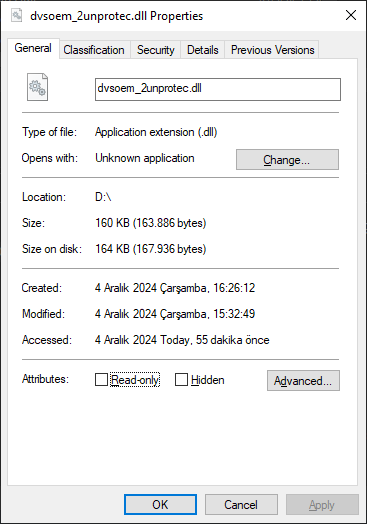
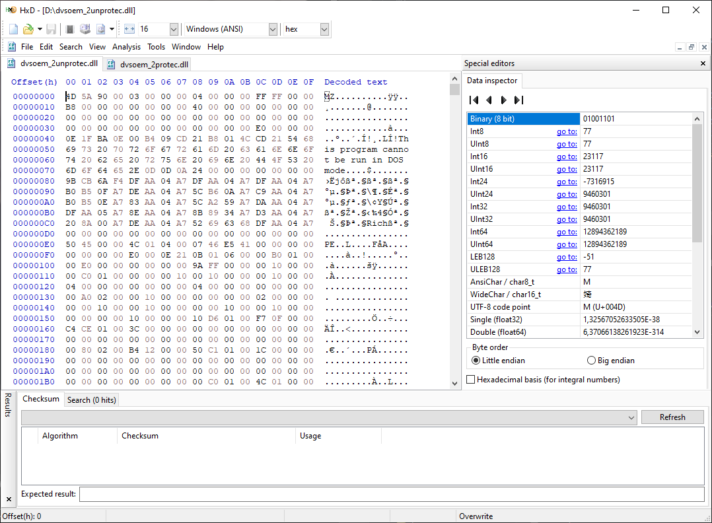

# Adobe Repacker and Installer Script - RIBS for Windows (for CS5 - CC 2015)
A .bat script that compresses unpacked Adobe RIBS assets and installs them.

# CAUTION!
Please, don't use this script for piracy things. I wrote this script for who wants to store RIBS-based Adobe application installers with unpacked assets for various reasons. My reason was maximize deduplication ratings on my Windows Server Storage Spaces storage to store more programs. That's why I wrote this script. I will improve this script day by day.

## Credits
- [Me](https://github.com/eflanili7881) for writing script.
- Adobe Systems Incorporated for providing applications.
- [bkcrack](https://github.com/kimci86/bkcrack) by [kimci86](https://github.com/kimci86) for ZipCrypto cracking software.
- PainteR for providing patched binaries for installing unpacked Adobe RIBS-based applications.
- [DB Browser for SQLite](https://sqlitebrowser.org) for editing and viewing various *.db databases.
- [HxD Hex Editor](https://mh-nexus.de/en/hxd) for hexadecimal viewing files.

## What does this script do?
This script compresses all unpacked assets that present on "payloads" and "packages" folder to temporary directory set by script, copies RIBS installer engine from installation media with unpacked assets excluded via excludepackages.txt and excludepayloads.txt that's generated via script and invokes Set-up.exe on temporary directory set by script to install repacked product.

## Requirements
- On default settings, you'll need 7-Zip installed on "C:\Program Files\7-Zip". But you can edit install.bat to change 7-Zip's location currently. I may update script to detect 7-Zip's install location by reading registry.
- Latest PowerShell for Windows XP(/x64)/Server 2003(/R2)(/x64)/Vista(/x64)/Server 2008/(/x64). Windows 7 and above comes with PowerShell by default.

## Limitations
- ZIP file must not exceed 2 GB. I tested this with HyperDrive installer engine and it throwed error. But I didn't tested this with RIBS engine. May it supports 2 GB+ files or not. Proceed with caution.
- If original Adobe application is installed with original RIBS engine, use install-admin-existing.bat. You need to run this file as administrator for temporarily replacing OOBE folder on C:\Program Files\Common Files\Adobe. This folder is where the installer engine is. If no Adobe application was installed before, use install-fresh.bat. You can run this file as normal user.

## Special note
- Unlike HyperDrive-based installers, with patched AdobePIM.dll, *.pima archives under "packages" folder can be repacked on CS6 - CC 2015 installer engines.
  - With original AdobePIM.dll and repacked *.pima archive, installer throws error about Adobe Genuine Software Validation Failure on initializing setup phase.
    - On CS6:

      

      - Installer throws error about Adobe Genuine Validation Failed at temporary folder (on my case, it's **C:/Users/Administrator/AppData/Local/Temp/PDApp.log**).

        

    - On CC 2013 and above:

      

      - Installer throws error about Adobe Genuine Validation Failed at temporary folder (on my case, it's **C:/Users/Administrator/AppData/Local/Temp/PDApp.log**).

        

  - With original Setup.dll and repacked *.zip archive, installer throws error about Adobe Genuine Software Verification Failure on install phase.
    - On CS6:
 
      

      - Installer throws error 37 and DW050 error on summary.html located in temporary folder (on my case, it's **C:/Users/Administrator/AppData/Local/Temp/{A4B00265-D898-42D4-AAC8-6C1DE7868025}/summary.htm**) and another log file located in **C:\Program Files (x86)\Common Files\Adobe\Installers\Adobe SpeedGrade CS6 6.0.0 11-15-2024.log.gz\Adobe SpeedGrade CS6 6.0.0 11-15-2024.log**.

        

        

    - On CC 2013 and above:

      

      - Installer throws error 37 on summary.html located in temporary folder (on my case, it's (**C:/Users/Administrator/AppData/Local/Temp/{B634FCA3-9EA6-46BB-86C8-DBBF5E305319}/summary.htm**) and another log file located in **C:\Program Files (x86)\Common Files\Adobe\Installers\Adobe SpeedGrade CC 7.0.0 11-15-2024.log.gz\Adobe SpeedGrade CC 7.0.0 11-15-2024.log**.

        

        
   
        - On log file, it also reports DW050 error.

          

  - You'll need packages, resources folder and Setup.exe (rename this file later as Set-up.exe, only on d!akov packages.) file from one of the RIBS-based d!akov or m0nkrus (On m0nkrus, take Set-up.exe, this will be same name like original installer unlike d!akov repacks, that has Setup.exe instead of Set-up.exe.). Unfortunately, this is the currently only way to install repacked RIBS assets. Original RIBS install engine throws error about software may counterfeit. Do not take "payloads" folder from d!akov repack because it contains pirated application. But we need the only install engine of d!akov to install our repacked assets.
    - You can manually patch legit Adobe RIBS installer by replacing this files from d!akov or m0nkrus distributions on RIBS-based legit installer engine:
      - CC 2014-era
        - Setup.dll
          - Binary path: packages\DECore\DECore.pima\DE6\Setup.dll
          - Binary version: 8.0.0.15
          - Binary purpose: Allows repacked asset archives to be installed.
        - updatercore.dll
          - Binary path: packages\UWA\UWA.pima\updatercore.dll
          - Binary version: 8.0.0.14
          - Binary purpose: Allows installing subscription updates on perpetual packages or vice versa.
        - AdobePIM.dll
          - Binary path: resources\AdobePIM.dll
          - Binary version: 8.0.0.73
          - Binary purpose: Allows repacked *.pima archives from packages folder to be loaded.
      - CC 2013-era
        - Setup.dll
          - Binary path: packages\DECore\DECore.pima\DE6\Setup.dll
          - Binary version: 7.0.0.103
          - Binary purpose: Allows repacked asset archives to be installed.
        - updatercore.dll
          - Binary path: packages\UWA\UWA.pima\updatercore.dll
          - Binary version: 7.0.0.27 (from slightly older engine)
          - Binary purpose: Allows installing subscription updates on perpetual packages or vice versa.
        - AdobePIM.dll
          - Binary path: resources\AdobePIM.dll
          - Binary version: 7.0.0.324
          - Binary purpose: Allows repacked *.pima archives from packages folder to be loaded.
      - When you try to replace these files with higher version on lower version RIBS engines, installation gives almost instant error and when you open summary.html or htm that installer generated, there is only System Requirements wrote as a link.
      - For Creative Cloud Packager, only replacing AdobePIM.dll on resources folder is enough and it doesn't throw any error. Replacing Setup.dll and updatercore.dll isn't necessary.
      - If \payloads\Media_db.db\PayloadData\ *(any payload ID that has higher version than current RIBS engine on **value** column)* \PayloadInfo is greater than current RIBS engine, installer throws this error on logs (i.e. for SpeedGrade CC 2015 with 8.0.0.15 engine):
        - *ERROR: DW021: Payload {8FD7F1DB-7355-469E-A3F2-2118148D8477} DVA Adobe SpeedGrade CC 2015 9.0.0.0 of version: 9.0.0.6 is not supported by this version: 8.0.0.15 of RIBS.*

          
            
        - This can be fixed with SQLite DB Browser.
          - Download this program from https://sqlitebrowser.org/dl/
            - Or if that page isn't available, but direct links are accessible:
              - 3.12.2 Windows 32-bit MSI Installer
                - Link: https://download.sqlitebrowser.org/DB.Browser.for.SQLite-3.12.2-win32.msi
                - Wayback Machine link: https://web.archive.org/web/20240308102559/https://download.sqlitebrowser.org/DB.Browser.for.SQLite-3.12.2-win32.msi
              - 3.12.2 Windows 32-bit Portable
                - Link: https://download.sqlitebrowser.org/DB.Browser.for.SQLite-3.12.2-win32.zip
                - Wayback Machine link: https://web.archive.org/web/20240308102755/https://download.sqlitebrowser.org/DB.Browser.for.SQLite-3.12.2-win32.zip
              - 3.12.2 Windows 64-bit MSI Installer
                - Link: https://download.sqlitebrowser.org/DB.Browser.for.SQLite-3.12.2-win64.msi
                - Wayback Machine link: https://web.archive.org/web/20240308102852/https://download.sqlitebrowser.org/DB.Browser.for.SQLite-3.12.2-win64.msi
              - 3.12.2 Windows 64-bit Portable
                - Link: https://download.sqlitebrowser.org/DB.Browser.for.SQLite-3.12.2-win64.zip
                - Wayback Machine link: https://web.archive.org/web/20240308103002/https://download.sqlitebrowser.org/DB.Browser.for.SQLite-3.12.2-win64.zip
              - 3.12.2 macOS Intel
                - Link: https://download.sqlitebrowser.org/DB.Browser.for.SQLite-3.12.2.dmg
                - Wayback Machine link: https://web.archive.org/web/20240308103609/https://download.sqlitebrowser.org/DB.Browser.for.SQLite-3.12.2.dmg
              - 3.12.2 macOS Apple Silicon
                - Link: https://download.sqlitebrowser.org/DB.Browser.for.SQLite-arm64-3.12.2.dmg
                - Wayback Machine link: https://web.archive.org/web/20240308104038/https://download.sqlitebrowser.org/DB.Browser.for.SQLite-arm64-3.12.2.dmg
          - Install SQLite Browser or directly open SQLite Browser if you downloaded portable version.
          - Open **(InstallMediaRoot)**\payloads\Media_db.db.
          - While payloads\Media_db.db is opened, go to "Execute SQL" tab.
            - You only need to patch payloads\Media_db.db to install application successfully. You don't need to patch Media_db.db inside \payloads\ * (i.e. AdobeBridge5-mul).
          - Than paste these 2 commands to separate lines:
            - update PayloadData **(do not execute command here.)**
            - set Value = replace(value, '9.0.0.6', '8.0.0.15') **(execute command here by pressing F5.)**
            - This will replace any 9.0.0.6 with 8.0.0.15.
             
              

            - You may change these versions depending on product you're gonna installing.
              - In example, you must replace 9.0.0.6 with 9.0.0.7 on Adobe Photoshop CC 2015.
        - Or you can replace installer engine with patched and newer version from following this guide on https://github.com/eflanili7881/AdobeRepackerAndInstallerScript/blob/RIBS-win-patchedbins/README.md#special-note
          - With this, you don't need to edit Media_db.db to allow lower versions of RIBS to install higher version packages.
  - Or to manually patch these Adobe DLL's, view special note section of https://github.com/eflanili7881/AdobeRepackerAndInstallerScript/blob/RIBS-win-patchedbins/README.md#special-note
- CS5.5 and CS5 do not require patching AdobePIM.dll to install repacked assets. Also, *.pima archives under "packages" directory can be repacked on CS5.5 and CS5 installers with original AdobePIM.dll. Because CS5.5 and below RIBS installer engines doesn't have file verification.
  - But some packages will be protected and they cannot be unpacked via 7-Zip. These packages will prompt for password if they tried to unpacked. Only RIBS installer engine can unpack these packages.
    - But weird thing is almost all packages has wrapper packages.
      - AdobePresenter706-AS_PC-mul doesn't have wrapper payload.
      - In example, AdobeEncore5RoyaltyAll and AdobeEncore5RoyaltyWrapperAll.
      - Wrapper packages are real protected payload installers.
        - In example, AdobePremierePro5RoyaltyWrapperAll installs to C:\Program Files\Adobe\Adobe Premiere Pro CS5\SetupRoyalty.
        - In example, AdobePremierePro5ProtectedWrapperAll installs to C:\Program Files\Adobe\Adobe Premiere Pro CS5\Setup.
      - Launching specific application will trigger of installation of these packages.
      - Probable standalone protected payloads used for repairing already installed protected payload.
    - But only wrapper packages are installed. Later, launching specific apps will install real protected payload.
    - Protected packages are below:
      - Creative Suite 5.5 (CS5.5)
        - AdobeAfterEffects10.5ProtectedAll
        - AdobeOnLocation5.1ProtectedAll
       - Creative Suite 5 (CS5)
        - AdobeAfterEffects10ProtectedAll
        - AdobeAfterEffects10RoyaltyAll
        - AdobeEncore5RoyaltyAll
        - AdobeOnLocation5ProtectedAll (I don't know if it's exist.)
        - AdobeOnLocation5RoyaltyAll
        - AdobePremierePro5ProtectedAll
        - AdobePremierePro5RoyaltyAll
        - AdobeSoundbooth3ProtectedAll
        - AdobeSoundbooth3RoyaltyAll
        - AMEDolby5All
        - AMEDolby5All_x64
        - AMEPCI5All
        - AMEPCI5All_x64
      - Miscellaneous
        - AdobePresenter706-AS_PC-mul (from Adobe Acrobat X Suite, I don't know other suite's reaction.)
      - Total packages: 16 (15 if AdobeOnLocation5ProtectedAll doesn't exist and I added this package as an error).
    - Example prompt of enter password (from **ASTE_AcrobatSte_10_J.7z\Adobe Acrobat X Suite\payloads\AdobePresenter706-AS_PC-mul\Assets1_1.zip** and **NanaZip 3.1 3.1.1080.0**):
     
      

    - But almost all packages has stored some *.png files as uncompressed (Stored as "Store" method on *.zip file). Only AdobePresenter706-AS_PC-mul, AdobeOnLocation5RoyaltyAll and AdobeOnLocation5.1ProtectedAll doesn't have file that stored as "Store" method; they're all stored as "Deflate" method.
    - Example output from AdobeEncore5RoyaltyAll\Assets2_1.zip (with bkcrack 1.7.0 x64):
     
      

    - If you examine _30_c542f7a7e42c7dbfca89edd858695fe5 on SQLite DB Browser, this file is actually **[AdobeCommon]\Keyfiles\Encore\en_ribs_bgd.png**
     
      

    - Almost all PNG files has header **89 50 4E 47 0D 0A 1A 0A 00 00 00 0D 49 48 44 52** (16 byte hex value) (example from one PNG image).
     
      

    - Saving header **89 50 4E 47 0D 0A 1A 0A 00 00 00 0D 49 48 44 52** to a empty file (I assume it saved as png.txt) and then running **bkcrack -C C:\Users\Administrator\Downloads\Programs\AdobeDownloads\AdobeZIPDecryption\encore5royalty_key_DONE\Assets2_1.zip -c _30_c542f7a7e42c7dbfca89edd858695fe5 -p C:\Users\Administrator\Downloads\Programs\AdobeDownloads\AdobeZIPDecryption\png.txt** gives us needed 3 keys to decrypt the files:
     
      

    - With running **bkcrack -C C:\Users\Administrator\Downloads\Programs\AdobeDownloads\AdobeZIPDecryption\encore5royalty_key_DONE\Assets2_1.zip -k bc6747e7 90ef9eb3 c8ccfc8c -D C:\Users\Administrator\Downloads\Programs\AdobeDownloads\AdobeZIPDecryption\encore5royalty_key_DONE\Assets2_1_nopass.zip**, you can save a copy of archive without password.
      - All files in same archive has same encryption key.
      - All Assets*_*.zip files in same payload have same 3 encryption keys.
        - In example, AdobeEncore5RoyaltyAll\Assets2_1.zip's encryption keys will work for AdobeEncore5RoyaltyAll\Assets1_1.zip, but not for AdobePremierePro5ProtectedAll\Assets2_1.zip.
    - Here the needed keys for decrypting archives via bkcrypt:
      - Creative Suite 5.5 (CS5.5)
        - AdobeAfterEffects10.5ProtectedAll
          - 8baf81d1 b7f4483b 7965f5ac
        - AdobeOnLocation5.1ProtectedAll
          - N/A
      - Creative Suite 5 (CS5)
        - AdobeAfterEffects10ProtectedAll
          - 8360d7ed abb8460f 16dd4c7c
        - AdobeAfterEffects10RoyaltyAll
          - 5d6d59df 7bdd9a85 db7a93a3
        - AdobeEncore5RoyaltyAll
          - bc6747e7 90ef9eb3 c8ccfc8c
        - AdobeOnLocation5RoyaltyAll
          - N/A
        - AdobeOnLocation5ProtectedAll (I don't know if it's exist.)
          - N/A
        - AdobePremierePro5ProtectedAll
          - e3980dd5 17605728 f475cf83
        - AdobePremierePro5RoyaltyAll
          - 5d756a2e 780657c6 22073806
        - AdobeSoundbooth3ProtectedAll
          - db0f3efe dbed56a4 475bc8b7
        - AdobeSoundbooth3RoyaltyAll
          - a918e87e 52daf956 c1a4cfe4
        - AMEDolby5All
          - 719284df 2a03ccd8 0a1b1d7e
        - AMEDolby5All_x64
          - ff3c28e8 f5b04927 00d32e37
        - AMEPCI5All
          - 8b9141e5 0b8a8f65 9faece7e
        - AMEPCI5All_x64
          - 672e3ca6 954708e3 9c061f76
      - Miscellenaous
        - AdobePresenter706-AS_PC-mul
          - N/A
      - Use this keys ONLY for unpacking and storing these payloads as unpacked, **NOT FOR PIRACY STUFF**.
    - Or you can install specific app (with serializing, protected payloads not installed if application is not installed with serial number), examine Install.db, copy files one by one to another location, rename these files with corresponding names from Install.db, pack these files to *.zip file and then change \payloads\Media_db.db\Payloads\ (payload ID for protected payload) \payload_type\protected to normal.
        - You need to launch specific application to install protected payload.
       
          

          

  - Despite with patched AdobePIM.dll that *.pima archives can be unpacked, minimal package set for just installing application with unpatched AdobePIM.dll and legit packed RIBS installer engine is this package set (with pirating, unfortunately (This package set gives error about Adobe Application Manager when application launches. If application is pirated, when you click OK, application will start with no problem.).):
    - core
    - D6
    - DECore
    - UWA
    - But if you want to use your legit license, it's all packages above with that extra package:
      - P6
- CS4 and CS3 doesn't require this script. Payloads stored as MSI installer and no verification is present except for protected ones (?). If installer assets unpacked via "msiexec /a" and replacing packed assets with unpacked ones, installer will install our unpacked assets with an honor.

## About MSI-based RIBS Applications (CS4 and below)
- On very big suites that contains small files or lots of files like Master Collection when MSI packages unpacked, initialization phase takes about like 10 minutes to 1 hour or longer depending on selected suite and hardware of PC that suite is going to be installed due to count of files (i.e. ~150K files alone in LS1 language group of Master Collection CS4).
  - For me, my system with these specs below, CS4 Design Premium LS1 (~110K files) took ~30 minutes to complete initialization phase:
    - CPU: Intel Core i5-3570 @ 3.40GHz (3.80GHz /w Turbo Boost)
    - RAM: 16GB (2x8GB) DDR3-1333MHz
    - MOBO: ZX-H61C/B75 V2.3
    - HDDOS: WDC WD10EZEX-08WN4A0
    - HDDInstallMedia: Same as HDDOS
  - For big packages like Master Collection, I suggest to put their install medium to very fast medium like SSD's if you can.
  - After that, installation takes much, much less time.
- MSI-based assets need to be unpacked with *.mst file if it exists.
  - This is also valid for Adobe Acrobat installers.
  - To do this, run:
    - msiexec /a X:\path\to\MSI\file.msi /qb targetdir=X:\path\to\expand transforms=X:\transform\file.mst
      - If you don't, some apps may say "source file not found" if app is tried to installed in languages other than English.
      - This may also fix bunch of CS3 packages.
- Unpack MSI files to very short location (i.e. D:\1) to avoid issues about file path limitation.
- Move unpacked assets via 7-Zip or other archive software after unpack of MSI is done as Windows Explorer may broke up something in our unpacked assets.
- Unpack MSI-based Adobe applications from very short location (i.e. D:\1) to avoid errors due to file path limitations.
- Copy your unpacked MSI-based application for installation with 7-Zip or other archive software to a very short location to avoid getting error about file path limitations.
- CS4 and CS3's protected content can be unpacked unlike in CS5 and above, but some packages will throw error on initialization phase. If you look installer logs, you will see i.e. AdobeAfterEffects9ProtectedAll was failed error 1603. I think it's also valid for CS3.
  - Errors are due to searching proxy file (even when proxy file is in root of the payload media, i.e. in payloads\AdobeAfterEffects9ProtectedAll\AdobeAfterEffects9ProtectedAll.proxy.xml, it isn't satisfied unless all subfolders inside of payload media checked).
    - Check for not unpackable packages section for more information.
  - For unpacking protected payloads, I think preventing errors possible when main application (i.e. AdobeAfterEffects9ProtectedAll requires? AdobeAfterEffects9All) needs to be installed first, protected application needs to be installed before unpacking due to Windows's PATH_MAX limit?.
    - If it's ignored, error 1304 and 2350 likely occurs due to this?
           
      

      

  - When CS3's protected content is unpacked, it'll unpacked identical as original files.
  - But on CS4, when protected MSI is unpacked, files will be larger variable even? (2, 4, 8, 16 or larger) bytes.
    - But if protected packages are installed, they shrunk exactly to their original sizes and they're accessible normally again.
    - Protected files' content are garbled while inside of installation media (i.e. for **C:\Program Files (x86)\Adobe\Adobe After Effects CS4\Mocha\bin\dvsoem.dll** before copied)
   
      

      

      - As you can see, file is 2 bytes larger than it's original size.
    - But after protected file copied into it's desired location, it'll shrink to it's original size and it's normally accessible again (i.e. for **C:\Program Files (x86)\Adobe\Adobe After Effects CS4\Mocha\bin\dvsoem.dll** after copied).
 
      

      

      - As you can see, file is more readable with HxD Hex Editor.
  - Interestingly on my tests with CS4, if protected content's payload path is beyond MAX_PATH variable, initialization phase is continued like nothing happened. But installer will fail gradually when installer tries to install protected unpacked content on specific packages. My theory was installer engine is so old that skips paths that beyond MAX_PATH limit on initialization phase. But on installation phase, it doesn't and it will fail.
    - But when I inspected location, file is copied, but it still gives this error.
      - If possible, enable **Local Computer Policy\Computer Configuration\Administrative Templated\System\Filesystem\Enable Win32 long paths**.
      - So, I guess this error can be ignored if above setting is enabled?
  - When I tried to unpack AdobePremierePro3ProtectedAll with all *.mst transform files, it unpacked and installed successfully without any error.
    - Currently not unpackable assets are:
      - Creative Suite 4 (CS4)
        - AdobeAfterEffects9All
          - Caused error
            - On Master Collection, Production Premium and probably on other suites, this package fails and gives permission error about AdobeAfterEffects9ProtectedAll directory inside of unpacked After Effects assets and throws error 1310 (Error writing to file: C:\Program Files (x86)\Common Files\Adobe\Installers\b2d6abde968e6f277ddbfd501383e02\payloads\AdobeAfterEffects9All\program files\Adobe\Adobe After Effects CS4\Support Files\(PCI)\Setup\payloads\AdobeAfterEffects9ProtectedAll\AdobeAfterEffects9ProtectedAll.proxy.xml. Verify that you have access to that directory.) and error 1603 on logs.
          - Note
            - I guess it's caused by Windows PATH_MAX limitation.
          - Fix
            - Move **program files\Adobe\Adobe After Effects CS4\Support Files\(PCI)\Setup\payloads\AdobeAfterEffects9ProtectedAll\AdobeAfterEffects9ProtectedAll.proxy.xml** to shorter directory on initialization phase. After initialization phase is done, move AdobeAfterEffects9ProtectedAll.proxy.xml again to it's original directory.
        - AdobeAfterEffects9FCAll
          - Caused error
            - Unpacked version prevents installation phase to be completed and it throws error 1603 on log (Fatal error occured during installation).
          - Note
            - On logs, log file says **CustomAction OEMSupportBlindCopy.E35C3ECB_5FDA_49E1_AB1F_D472B7CB90171 returned actual error code 1603 (note this may not be 100% accurate if translation happened inside sandbox)**
          - Fix
            - Move **program files** folder to root of install media while intialization phase. After initialization phase is done, move **program files** back to it's original location.
        - AdobeAfterEffects9ProtectedAll
          - Caused error
            - Package normally unpackable, but it throws error 1603 while initialization phase. Not on standalone program, but on Master Collection and likely on other suites that contains this package, throws error 1304 about copying file. Even if you try to click "Retry", it throws internal error 2350 and unpack fails.
           
              

              

          - Note
            - On logs, log file says **CustomAction OEMSupportBlindCopy.E35C3ECB_5FDA_49E1_AB1F_D472B7CB90171 returned actual error code 1603 (note this may not be 100% accurate if translation happened inside sandbox)**
          - Fix
            - Move **Common** and **program files** folder to root of install media folder while intialization phase. After initialization phase is done, move **Common** and **program files** back to their original locations. I think preventing errors possible when main application (i.e. AdobeAfterEffects9ProtectedAll requires? AdobeAfterEffects9All) needs to be installed first, protected application needs to be installed before unpacking due to Windows's PATH_MAX limit?.
              - If you move installer even into root of the filesystem, error 1603 and 1309 still occurs.
                - But when I inspected location, file is copied, but it still gives this error.
                  - If possible, enable **Local Computer Policy\Computer Configuration\Administrative Templated\System\Filesystem\Enable Win32 long paths**.
                  - So, I guess this error can be ignored if above setting is enabled?
        - AdobeCaptivate4*
          - Caused error
            - Installation fails with error 1603.
          - Note
          - Fix
        - AdobeContribute-PDistiller-mul\de_DE
          - Caused error
            - Throws error 2715 on unpacking.
          - Note
          - Fix
            - You can fix this with Orca MSI Editor.
              - Download Orca MSI editor from https://www.technipages.com/downloads/OrcaMSI.zip
                - If it's deleted, you can download this package from Wayback Machine on https://web.archive.org/web/20240308101549/https://www.technipages.com/downloads/OrcaMSI.zip
              - On Orca, search Docs_DistillerS_DEU on Components table.
              - When found, replace ACROHELP.DISTS_DEU with ACROHELP_DISTS_DEU.pdf.
              - On unpacked directory, perform replace operation exact opposite direction.
            - This also happens in CS6 packages that contains this package (also de-DE language).
        - AdobeDirector11.5*
          - Caused error
            - Package normally unpackable, but it throws error 1603 while initialization phase.
          - Note
          - Fix
        - AdobeVersionCue4All
          - Caused error
            - Package normally unpackable, but it throws error 1603 (Fatal error occured during installation) on log while initialization phase.
          - Note
            - On logs, log file says **CustomAction OEMSupportBlindCopy.E35C3ECB_5FDA_49E1_AB1F_D472B7CB90171 returned actual error code 1603 (note this may not be 100% accurate if translation happened inside sandbox)**
          - Fix
            - Move **Common** and **Windows** folder to root of install media while intialization phase. After initialization phase is done, move **Common** and **Windows** back to their original locations.
        - MSXML6.0
          - Caused error
            - Normally it's unpackable, but due to conflict between x64 and ia64, I not prefer unpack this payload folder. If you try to separate folder into individual payloads, at initialization phase, nothing happens and installation not starts due to payload ID conflict I guess.
          - Note
          - Fix
            - You can rename DLL files by adding their architectures to end.
              - In example, msxml6.ia64.dll for IA-64 version of Microsoft XML Parser.
      - Creative Suite 3 (CS3)
        - AdobeAfterEffects8All
          - Caused error
            - Normally unpackable but this package fails and gives permission error about AdobeAfterEffects8ProtectedAll directory inside of unpacked After Effects assets (Error 1310. Error writing to file: C:\Program Files (x86)\Common Files\Adobe\Installers\5d83aea83f5009a0d267d337e3f55fe\payloads\AdobeAfterEffects8All\program files\Adobe\Adobe After Effects CS3\Support Files\(PCI)\Setup\payloads\AdobeAfterEffects8ProtectedAll\AdobeAfterEffects8ProtectedAll.proxy.xml. Verify that you have access to that directory.) and throws error 1603 on logs.
          - Note
          - Fix
            - Unpack .msi files with .mst files. Unpacked and installed on Adobe Master Collection CS3. It didn't give any error. Or moving unpacked assets with 7-Zip did something.
        - AdobeAfterEffects8FCAll
          - Caused error
            - Unpacked version prevents installation phase to be completed and it throws error 1603 (Fatal error during installation) on logs.
          - Note
          - Fix
        - AdobeAfterEffects8ProtectedAll
          - Caused error
            - Throws error 1304 about copying file. Even if you try to click "Retry", it throws error 2350 and unpack fails.
          - Note
            - Even if you somehow unpack this package, it throws error code 1603 on log.
          - Fix
        - AdobeEncore3All
          - Caused error
            - Installation fails with error 1603.
          - Note
            - It may caused from not unpacking .msi file without .mst transform. I will update here if it's true.
          - Fix
            - Unpack .msi files with .mst files. Unpacked and installed on Adobe Master Collection CS3. It didn't give any error. Or moving unpacked assets with 7-Zip did something.
        - AdobeIllustrator13*
          - Caused error
            - Installation fails with error 1603.
          - Note
            - It may caused from not unpacking .msi file without .mst transform. I will update here if it's true.
          - Fix
            - Unpack .msi files with .mst files. Unpacked and installed on Adobe Master Collection CS3. It didn't give any error. Or moving unpacked assets with 7-Zip did something.
        - AdobeInCopy5*
          - Caused error
            - Installation fails with error 1603.
          - Note
            - It may caused from not unpacking .msi file without .mst transform. I will update here if it's true.
          - Fix
            - Unpack .msi files with .mst files. Unpacked and installed on Adobe Master Collection CS3. It didn't give any error. Or moving unpacked assets with 7-Zip did something.
        - AdobeInDesign5*
          - Caused error
            - Installation fails with error 1603.
          - Note
            - It may caused from not unpacking .msi file without .mst transform. I will update here if it's true.
          - Fix
            - Unpack .msi files with .mst files. Unpacked and installed on Adobe Master Collection CS3. It didn't give any error. Or moving unpacked assets with 7-Zip did something.
        - AdobePhotoshop10*
          - Caused error
            - Installation fails with error 1603.
          - Note
            - It may caused from not unpacking .msi file without .mst transform. I will update here if it's true.
          - Fix
            - Unpack .msi files with .mst files. Unpacked and installed on Adobe Master Collection CS3. It didn't give any error. Or moving unpacked assets with 7-Zip did something.
        - AdobePremierePro3All
          - Caused error
            - Installation fails with error 1603.
          - Note
            - It may caused from not unpacking .msi file without .mst transform. I will update here if it's true.
          - Fix
            - Unpack .msi files with .mst files. Unpacked and installed on Adobe Master Collection CS3. It didn't give any error. Or moving unpacked assets with 7-Zip did something.
        - AdobeSoundboothAll
          - Caused error
            - Installation fails with error 1603 on Master Collection.
          - Note
            - ~~I don't have standalone product to test standalone product's reaction :(( (If somebody have standalone Adobe Soundbooth CS3 installer, you can write me :)) )~~ Thanks to user [bitaliy1500](https://archive.org/details/@vitaliys2005) from archive.org, I got the standalone copy of Adobe Soundbooth CS3!
          - Fix
            - Unpack .msi files with .mst files. Unpacked and installed on Adobe Master Collection CS3. It didn't give any error. Or moving unpacked assets with 7-Zip did something.
        - But some CS3 main packs can be unpacked. These are:
          - AdobeDreamweaver9*
          - AdobeFlash9*
          - AdobeFireworks9*
          - AdobeIllustrator13*
            - Only on Master Collection.
          - AdobeInDesign5*
            - Only on Master Collection.
          - AdobePhotoshop10*
            - Only on Master Collection.
          - AdobeContribute4.1*
            - On Adobe Acrobat Pro 8 (in suites), they may say **C:\program files\Adobe\Acrobat 8.0\Acrobat\Xtras\AdobePDF\I386\ADOBEPDF.DLL** is missing during install. Specifying **\payloads\AdobeAcrobat8de_DE\program files\Adobe\Acrobat 8.0\Acrobat\Xtras\AdobePDF\I386\ADOBEPDF.DLL** will solves this.
