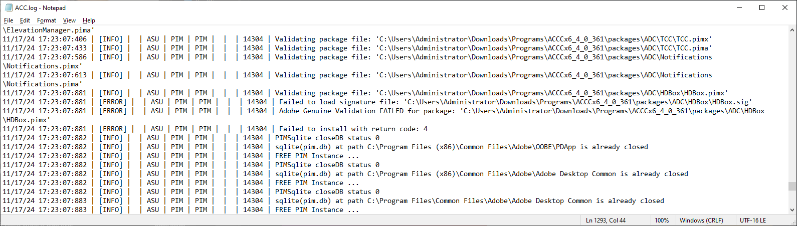

# Adobe Repacker and Installer Script - HyperDrive (HD) for Windows (for CC 2015 - present)
A .bat script that compresses unpacked Adobe HyperDrive (HD) assets and installs them.

# CAUTION!
Please, don't use this script for piracy things. I wrote this script for who wants to store HyperDrive (HD)-based Adobe application installers with unpacked assets for various reasons. My reason was maximize deduplication ratings on my Windows Server Storage Spaces storage to store more programs. That's why I wrote this script. I will improve this script day by day.

## Credits
- Mentioned on https://github.com/eflanili7881/AdobeRepackerAndInstallerScript/blob/main/README.md#credits

## What does this script do?
This script compresses all unpacked assets that present on "products" folder to temporary directory set by script, copies HyperDrive installer engine from installation media with unpacked assets excluded via exclude.txt that's generated via script and invokes Set-up.exe on temporary directory set by script to install repacked product.

## Requirements
- ~~On default settings, you'll need 7-Zip installed on "C:\Program Files\7-Zip". But you can edit install.bat to change 7-Zip's location currently. I may update script to detect 7-Zip's install location by reading registry.~~
  - From v0.3.0, you can select 7-Zip Console's binary path.
- ~~Latest PowerShell for Windows. Without updating PowerShell, it may work but folder scanning may not successful.~~
  - From v0.3.0, it's not necessary.

## Limitations
- ~~*.pima archives under "packages" directory (for Creative Cloud itself) cannot be unpacked and repacked because Creative Cloud installer throws error 4 with original AdobePIM.dll and modified *.pima archive.~~

  

  - ~~I can't find error code on website.~~
  - ~~When I try to launch installer via **\packages\ACC\Utils\Utils.pima\CreativeCloudSet-Up.exe (copied it Creative Cloud's install root)**, error 4 appears.~~
 
    

  - ~~It mentions Adobe Genuine Validation failed with error 4 on **C:\Users\Administrator\AppData\Local\Temp\CreativeCloud\ACC\ACC.log**~~
 
    

~~I think HyperDrive install engine doesn't enforces signatures to be valid on "products" directory, but enforces signatures to be valid on "packages" directory.~~
  - ~~If I try to patch AdobePIM.dll with any patching method, error 42 occurs.~~

    

    

  - ~~When I try to launch installer via **\packages\ACC\Utils\Utils.pima\CreativeCloudSet-Up.exe (copied it Creative Cloud's install root)**, error 72 appears.~~

    

    

    
    
    - ~~Both errors suggests it's signature validation error.~~
  - ~~When I examined **C:\Users\Administrator\AppData\Local\Temp\CreativeCloud\ACC\WAM.log**, it shows error about CANameChain.~~

    

    - ~~It also mentions error 42 below.~~
  - ~~But on HyperDrive installer engine on KpoJIuK repacks, some *.pima archives were different sizes (i.e. \packages\ADC\Runtime\Runtime.pima because KpoJIuK installers have separate Microsoft Visual Studio C++ Redistributable installer). Maybe ADC folder was excluded from signature verification or KpoJIuK may patched installer to force installing his edited *.pima assets, I don't know.~~
  - ~~Also on KpoJIuK repacks, I looked into ApplicationInfo.xml and I see all packages for ACC but HDCore and some other packages were disabled. You can disable every package, except HDCore on ACC and HDBox on ADC package set in ApplicationInfo.xml. Then, all of the packages assets can be deleted, again except HDCore and HDBox. That's maybe not unpacking but you can reduce footprint of installer with this way. This is exactly what AntiCC does. Installing bare minimum packages for installing HyperDrive-based applications.~~
    - ~~Uninstalling application may stuck on %100 after you want to uninstall even if uninstallation was completed. Killing Set-up.exe processes works.~~
      - ~~Or you can just install full Creative Cloud desktop after installing product just to be sure the product was %100 successfully uninstalled.~~
    - With my recent searches, it's now possible. More details on https://github.com/eflanili7881/AdobeRepackerAndInstallerScript/tree/HyperDrive-win-patchedbins
- ZIP file must not exceed 2 GB. I tested Premiere Pro with -mx0 flag on 7z command line and HyperDrive installer engine throws error. Maybe it's with CompressionType on Application.json or something.
- ~~Currently, LZMA2-compressed ZIP files cannot be unpacked and repacked. They cannot be unpacked with 7-Zip itself. They may obtainable if unpacked version is copied from adobeTemp directory really fast. Because as soon as install finishes, HyperDrive installer engine deletes that files as soon as possible.~~
  - With script I wrote in https://github.com/eflanili7881/AdobeLZMA2UnpackerScript , they can now be unpacked.

## Known Issues
- ~~On exclude.txt and compress.txt, first lines be bugged (it looks fine, but while command processes, *packages* turns into *´╗┐packages* i.e.).~~
  - ~~To solve this, copy first line just below the first line.~~
    - ~~If output's like this:~~
      - ~~products\AEFT~~
      - ~~products\KFNT~~
      - ~~products\ACR~~
    - ~~After that, output should be like this:~~
      - ~~products\AEFT~~
      - ~~products\AEFT~~
      - ~~products\KFNT~~
      - ~~products\ACR~~
  - ~~I think this caused by auto creation by PowerShell script. When I freshly create .txt file from New menu from right click, this bug didn't happen. I don't know what causes this. Probably invisible special ASCII or Unicode character for initiating start of text file by PowerShell.~~
  - With v0.3.0, it's fixed.
