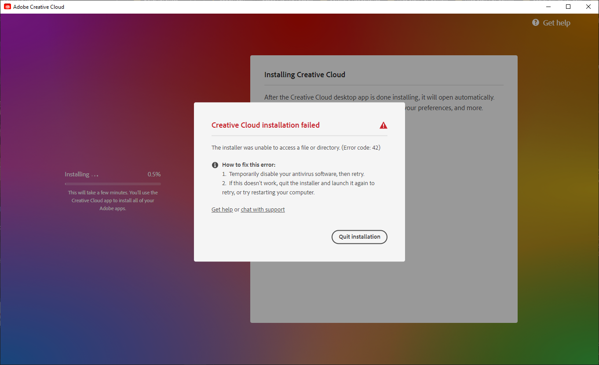

# Adobe Repacker and Installer Script - Patched Binaries for ZIP-based HyperDrive Installers for Windows (for CC 2015 - present)
A repo that contains patched binaries for installing unpacked Adobe Creative Cloud *.pima assets.

# CAUTION!
Please, don't use this branch's content for piracy things. I put this patched binaries for who wants to install their unpacked RIBS-based Adobe application installers for various reasons. My reason was maximize deduplication ratings on my Windows Server Storage Spaces storage to store more programs.

# CAUTION!
Please, don't use this branch's content for piracy things. I put this patched binaries for who wants to install their unpacked RIBS-based Adobe application installers for various reasons. My reason was maximize deduplication ratings on my Windows Server Storage Spaces storage to store more programs.

# CAUTION!
Please, don't use this branch's content for piracy things. I put this patched binaries for who wants to install their unpacked RIBS-based Adobe application installers for various reasons. My reason was maximize deduplication ratings on my Windows Server Storage Spaces storage to store more programs.

## Why I repeated above thing 3 times?
Because I'm afraid that Adobe can copy-strike me like on archive.org. I put these instructions for **LEGITIMATE** users.

## Credits
- Mentioned on https://github.com/eflanili7881/AdobeRepackerAndInstallerScript/blob/main/README.md#credits

## What's this repo contains?
This repo contains patched binaries for installing unpacked Adobe Creative Cloud *.pima assets.

## Special note
- Normally, HyperDrive-based installers doesn't have any verification mechanism for "products" folder. But on "packages" folder, HyperDrive-based installers enforce signature to be valid.
  - If you try patch AdobePIM.dll with Set-up.exe version **x>=4.6.0.391**, it gives error 42 or 72.

    

    

    - When I try to launch installer via **\packages\ACC\Utils\Utils.pima\CreativeCloudSet-Up.exe (copied it Creative Cloud's install root (version x>=4.6.0.391))**, error 72 appears.

      

      

      
    
        - Both errors suggests it's signature validation error.
    - Because version **x>=4.6.0.391**, it enforces Adobe account login and file signatures to be valid.
   
      

      - If you try to install Adobe Creative Cloud with Set-up.exe version **x>=4.6.0.391** above errors will occur.
    - **\Set-up.exe** and **\packages\ACCC\Utils\Utils.pima\CreativeCloudSet-Up.exe**'s file sizes and hashes will be different for version **x>=4.6.0.391**.
      - File size:

        
   
        
   
      - Hash:
     
        
        
        

      - I think size difference comes from "login page" stuff.
        - When I try to launch installer via **\packages\ACC\Utils\Utils.pima\CreativeCloudSet-Up.exe (copied it Creative Cloud's install root (version x>=4.6.0.391))**, above errors will be occur.
  - But Set-up.exe version **x<=4.5.0.331** doesn't enforces user to login Adobe account and file signature to be valid. With this, you can patch AdobePIM.dll and use Set-up.exe version **x<=4.5.0.331**, you can install repacked *.pima archives with no issue.
 
    

    - **\Set-up.exe** and **\packages\ACCC\Utils\Utils.pima\CreativeCloudSet-Up.exe**'s file sizes and hashes will be same for version x<=4.5.0.331.
      - File size:
   
        

        

      - Hash:
     
        

        

    - But if you try to install HyperDrive-based apps with patched AdobePIM.dll and Set-up.exe from **\packages\ACCC\HDCore\HDCore.pima\Set-up.exe (x<=4.3.0.256)** or **\packages\ADC\HDBox\HDBox.pima\Set-up.exe (x>=4.4.0.294)**, it gives error about installer file maybe damaged.
      - x<=4.3.0.256:
     
        

      - x>=4.4.0.294:
     
        

      - But if you install Creative Cloud first, reverting patch on AdobePIM.dll that I'm gonna mention on "To patch dll's" section or restoring original AdobePIM.dll and then running Set-up.exe  from **\packages\ACCC\HDCore\HDCore.pima\Set-up.exe (x<=4.3.0.256)** or **\packages\ADC\HDBox\HDBox.pima\Set-up.exe (x>=4.4.0.294)** will work as HyperDrive installer will skip already installed Adobe Creative Cloud packages.
        - You must disconnect from internet if you:
          - Get "Update your browser" notification,
         
            
            
          - Don't want to use Adobe account.
          - Or want to prevent Adobe Creative Cloud to auto-update itself at least for installation process.
  - To patch dll's:
    - Download Cutter from https://cutter.re or https://github.com/rizinorg/cutter/releases and IDA Pro 6.5 or newer on https://hex-rays.com/ida-pro
    - Install Cutter and IDA Pro 6.5 or newer.
    # - On AdobePIM.dll (on 6.3.1.470):
      - Probably you can use this method for all versions.
        - Open AdobePIM.dll with IDA Pro 6.5 or newer with Portable executable for 80386 (PE) (pe64.dll) decompiler.
        - On IDA Pro, search for string **corrupt**.
        - Select **aFileSIsCorrupted_0** that's on bottom (In case, it's 0x100265DD)
       
          

          

        - Locate the end of the box that's connected before (In case, it's 0x100265BC).
       
          

        - You've got necessary address to change on Cutter.
        - Open AdobePIM.dll on Cutter with experimental (aaaa) mode and in write mode (-w).
        - Jump to address 0x100265BC.
       
          

        - Change **jne 0x100265c7** to **jne 0x100265be** with disabling *Fill all remaining bytes with NOP opcodes*.
        - When you reload file with same settings, graph will turn into this:
       
          

        - As you can see, the box that contains error condition for signature verification failure is not visible anymore.

## How to build unpacked HyperDrive app installer?
Currently script doesn't repack Creative Cloud packages on **packages** folder (*.pima archives). I will update script to repack these packages as well.
- I assume you got:
  - **ACCCx4_5_0_331.zip** (If you're gonna use Adobe Creative Cloud version **x>=4.6.0.384**),
  - **ACCCx(version_numer_you_want).zip** (You can use only this version if you're gonna use Adobe Creative Cloud version **x<=4.5.0.331**),
  - **ACCCx5_3_1_470.zip** (For installing HyperDrive-based applications with same **packages** structure from Creative Cloud installer if you're gonna use **x=>5.3.5.518 (or 5.3.5.499 if you're gonna use prerelease copy of first Creative Cloud version that supports ARM64 platform natively.)**),
  - **products** folder for your app.
  - and **resources/content/images/appIcon.png** for your product.
    - (Optional) and **resources/content/images/appIcon2x.png** for your product.
- Extract **ACCCx(version_numer_you_want).zip** to a directory.
- Delete Set-up.exe and replace Set-up.exe from **ACCCx4_5_0_331.zip**.
  - Or **ACCCx(version_numer_you_want).zip** if you're gonna use Adobe Creative Cloud version **x<=4.5.0.331**.
- Then, rename Set-up.exe to anything you want (i.e. Set-up_CC.exe (for installing Adobe Creative Cloud)).
- On **packages** folder, extract every *.pima archive to same folder where original *.pima archive is located.
  - Structure should like this:
    - packages\ADC\HDBox\HDBox
      - <contentsOfHDBox.pimaArchive>
    - packages\ADC\HDBox\HDBox.sig
    - packages\ADC\HDBox\HDBox.pimx
- Delete original *.pima archives after extraction is done.
- Put **products** folder to where you **ACCCx(version_numer_you_want).zip** is extracted.
- On **products** folder, extract every *.zip archive to same folder where original *.zip archive is located.
  - Structure should like this:
    - products\AUDT\AdobeAudition10All
      - <contentsOfAdobeAudition10All.zipArchive>
    - products\AUDT\application.json
- Delete original *.zip archives after extraction is done.
- Put **resources\content\images\appIcon.png** to where you **ACCCx(version_numer_you_want).zip** is extracted.
  - (Optional) Put **resources\content\images\appIcon2x.png** to where you **ACCCx(version_numer_you_want).zip** is extracted.
- Get Set-up.exe from **ACCCx(version_numer_you_want).zip\packages\ADC\HDBox\HDBox.pima\Set-up.exe** and put Set-up.exe to where you extracted **ACCCx(version_numer_you_want).zip** if bundled version of Creative Cloud is **x<=5.3.1.470**.
  - Get Set-up.exe from **ACCCx5_3_1_470.zip\packages\ADC\HDBox\HDBox.pima\Set-up.exe** and put Set-up.exe to where you extracted **ACCCx5_3_1_470.zip** if bundled version of Creative Cloud is **x=>5.3.5.518 (or 5.3.5.499 if you're gonna use prerelease copy of first Creative Cloud version that supports ARM64 platform natively.)**.
- Rename Set-up.exe to anything you want (i.e. Set-up_HD.exe (for installing Adobe HyperDrive-based applications)).
- Move your original AdobePIM.dll to AdobePIM_original.dll.
- Make backup of your AdobePIM.dll.
- Patch the AdobePIM.dll.
- Move your patched AdobePIM.dll to AdobePIM_patched.dll.
- Copy your unpacked installer to your storage server and run deduplication right after unpacked installer is copied if you want.
